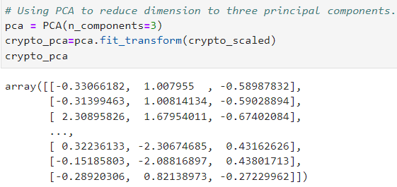

# Cryptocurrencies
Module 18
## Overview
Accountability Accounting is one of our most important customers and a prominent investment bank.  Martha, a senior manager for the company stated that Accountability Accounting is interested in offering a new cryptocurrency investment portfolio for its customers. The company, however, is lost in the vast universe of cryptocurrencies. So, they’ve asked you to create a report that includes what cryptocurrencies are on the trading market and how they could be grouped to create a classification system for this new investment.

The data provided is not ideal and will need to be processed to fit the machine learning models. Since there is no known output for what Martha is looking for, we decided to use unsupervised learning. To group the cryptocurrencies, Martha decided on a clustering algorithm. We will provide visuals so that Martha can provide info to the board.

## Purpose

The purpose of this project is to utilize lessons learned during this module to implement unsupervised machine learning.  We will use Python, Plotly, hvplot, and sklearn to process the data, clean the data, scale the data, and create Kmeans.

### Deliverable 1: Preprocessing the Data for PCA
* Initial load of the crypto_data.csv into the data frame

* Removing rows of data for cryptocurrency not trading

* Drop IsTrading Column as it is not important to this Machine Learning exercise

* This screen shot below shows the dataframe with just the cryptocurrency that has been mined

* The screenshot below shows a dataframe with just the cryptocurrency name and set index

* CoinName is dropped in the screenshot of the dataframe below as it will not be used in the clustering algorithm

* The screenshot below shows the GetDummies method to convert non-numeric data into numeric as Machine Learning requires numeric data

* Data becomes scaled.

### Deliverable 2: Reducing Data Dimensions Using PCA

* The screenshot below illustrates using PCA to reduce dimension to three principal components.

* After reducing dimension to three principal components a dataframe is created.

### Deliverable 3: Clustering Cryptocurrencies Using K-means

* The screenshot below is the result of the creation of the elbow plot that returns a K-means of 4

* K-Means clustering is conducted based on the K-means value that was pulled from the Elbow Curve

* Dataframe created based on the clustered data

### Deliverable 4: Visualizing Cryptocurrencies Results

* Based on the cluster data created during deliverable 3, a 3-D scatter plot is created as seen below.

* Table is created below to show hvplot table creation capabilities

* After the data is scaled using MinMaxScaler().fit_transform, the following dataframe is created

* Based on the information above, a dataframe is constructed highlighting the scaled data

## Analysis

Interesting project with many preprocessing, disassembling and re-assembling of the data sets.
